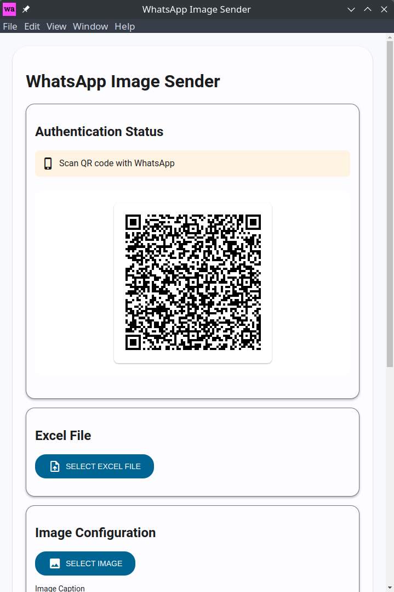
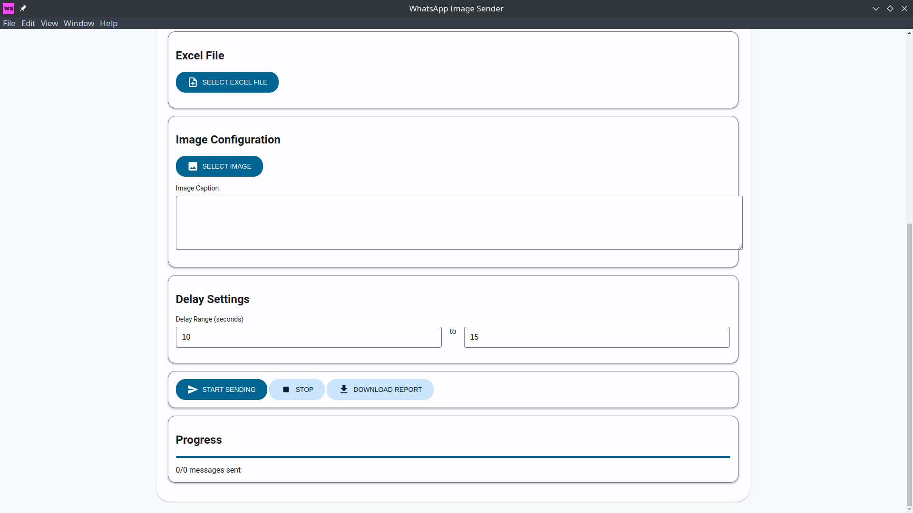

# WhatsApp Bulk Message Sender

A desktop application built with Electron and Puppeteer that allows you to send bulk messages on WhatsApp Web safely and efficiently.





## Features

- 📱 Send messages to multiple WhatsApp contacts/groups
- 📁 Import contacts from CSV/Excel files
- ⏱ Customizable delay between messages to avoid spam detection
- 🔄 Session management (stays logged in)
- 📝 Message templates with variable support
- 📊 Delivery status tracking
- 🌐 Works with WhatsApp Web
- 🔒 Privacy-focused (runs locally on your machine)

## Installation

```bash
# Clone the repository

# Navigate to project directory
cd whatsapp-bulk-sender

# Install dependencies
npm install
```

## Usage

1. Start the application:
```bash
npm start
```

2. Scan the QR code with WhatsApp mobile app to log in

3. Import contacts:
   - Click "Import Contacts" button
   - Select your Excel file
   - Map the columns to required fields (Name, Phone Number)

4. Compose message:
   - Type your message in the editor
   - Use variables like {name} for personalization
   - Preview the message before sending

5. Configure sending options:
   - Set delay between messages (recommended: 5-10 seconds)
   - Choose whether to include media files


6. Start sending:
   - Click "Start Campaign" button
   - Monitor progress in real-time
   - View delivery status for each message


## Technical Details

- Built with Electron v27.x
- Uses Puppeteer for WhatsApp Web automation
- Node.js v18+ required
- Supports Windows, macOS, and Linux

## Security Features

- Local session storage
- No message content stored permanently
- No external API calls
- Respects WhatsApp's rate limits
- Automatic cleanup of temporary files

## Limitations

- Requires active internet connection
- Phone must be online for initial QR scan
- Subject to WhatsApp's terms of service
- Maximum recommended messages per day: 100
- Media files limited to 16MB

## Troubleshooting

### Common Issues

1. **QR Code Not Scanning**
   - Ensure phone has stable internet connection
   - Try refreshing the QR code
   - Update WhatsApp mobile app

2. **Messages Not Sending**
   - Check internet connection
   - Verify phone number format
   - Increase delay between messages
   - Ensure WhatsApp Web is logged in

3. **Application Crashes**
   - Check system requirements
   - Update application dependencies
   - Clear cache and temporary files

## Legal Notice

This tool is meant for legitimate business communication only. Users are responsible for:
- Getting consent from recipients
- Complying with local spam laws
- Following WhatsApp's terms of service
- Respecting message sending limits

## Contributing

1. Fork the repository
2. Create feature branch (`git checkout -b feature/amazing-feature`)
3. Commit changes (`git commit -m 'Add amazing feature'`)
4. Push to branch (`git push origin feature/amazing-feature`)
5. Open Pull Request

## License

This project is licensed under the MIT License - see the [LICENSE](LICENSE) file for details.

## Disclaimer

This application is not affiliated with WhatsApp or Meta. Use at your own risk. Developers are not responsible for any misuse or blocked accounts.

## Support

- Create an issue for bug reports
- Join our Discord community for discussions
- Check FAQ in wiki for common questions

---

**Note**: Always use this tool responsibly and in accordance with WhatsApp's terms of service to avoid account restrictions.
